<div align="center">

# Hey there! 👋 I'm **Arjan** 
### 🚀 *Full-stack Tinkerer • Hardware Enthusiast • Low Level Mad*

[](https://git.io/typing-svg)

---

## 🎯 **About Me**

```typescript
const arjan = {
    pronouns: "he/him",
    location: "🌍 India",
    currentFocus: ["Arduino Projects", "Web Dev", "Systems Programming"],
    languages: ["Java", "Python", "Rust", "JavaScript", "C++","Flutter"],
    askMeAbout: ["Web Dev", "Arduino", "Hardware Hacking", "Open Source"],
    funFact: "Systems programmign better than ML."
};
```

---

## 🛠️ **Tech Arsenal**

<table>
<tr>
<td valign="top" width="33%">

### 🌐 **Frontend**


</td>
<td valign="top" width="33%">

### ⚙️ **Backend & Systems**


</td>
<td valign="top" width="33%">

### 🔧 **Hardware & Tools**


### ⚙️ **Native Development**


</td>
</tr>
</table>

---

## 🌱 **Current Learning Journey**

<div align="center">

| 🎯 **Focus Area** | 📚 **Learning** | 🚀 **Progress** |
|:---:|:---:|:---:|
| **Arduino Mastery** | Advanced microcontroller programming | ███░░ 30% |
| **Web Development** | Frontend | ██████░░░ 60% |
| **Java Deep Dive** | Basics | █░░░░ 10% |
| **Rust Systems** | Memory safety & performance optimization | ████░░░░░ 40% |
| **Flutter** | A way to build native apps beautifully!| ██████░░░ 60% |

</div>

---

## 🔥 **What I'm Building**

```mermaid
graph LR
    A[💡 Ideas] --> B[🔬 Arduino Projects]
    A --> C[🌐 Web Applications]
    A --> D[🛠️ System Tools]
    B --> E[🚀 Innovation]
    C --> E
    D --> E
```



### 🎯 **Current Projects**
- 🌐 **Developer Portfolio** - Showcasing my journey
- 🔧 **Chrome Extension Tools** - Productivity boosters
- 📱 **Mobile-First Web Apps** - Modern, responsive designs

---

## 📊 **GitHub Analytics**

<div align="center">


</div>

---

## 🎨 **Philosophy**

<div align="center">

> *"Code is poetry written in logic"* 📝 
> *"Hardware is the canvas, software is the brush"* 🎨 
> *"Every bug is a puzzle waiting to be solved"* 🧩  

### 💫 **Core Values**
🎯 **Clean, Readable Code** • 🚀 **Performance First** • 🤝 **Open Collaboration** • 📚 **Continuous Learning**

</div>

---

## 🤝 **Let's Connect & Collaborate**

<div align="center">

[](mailto:aryaarjan1@gmail.com)
[](https://github.com/Arjan-Git1)


### 🎯 **Open to collaborating on:**
🔹 Arduino & IoT Projects  
🔹 Full-Stack Web Applications  
🔹 Open Source Contributions  
🔹 Hardware-Software Integration  
🔹 Educational Tech Content  

</div>

---

<div align="center">

## 🎯 **Daily Motto**

*"Just code it"* 


**⭐ Star my repos if you find them interesting!**

</div>

---

<div align="center">
<sub>💙 Made with passion and lots of coffee ☕</sub>
</div>


